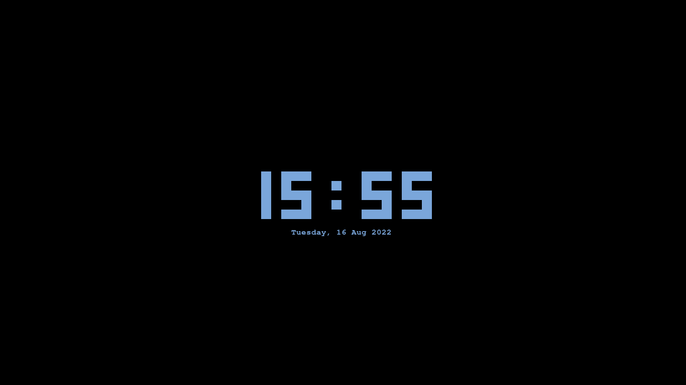

<div align="center">
    <h1>R-clock</h1>
    
    <h1></h1>
</div>

## What's that
R-clock is a clock for terminal interfaces, this will get the week day, month day, month, year, hours, minutes and optionally seconds from your system. like a normal clock

## Compilation time
The R-clock is made in Rust programming language, so to compile the project just go to the project's folder and run the following command in terminal: 
```sh
cargo build
```


### Running
By default, the executable is in target/debug/rclock. If you wan't run directly just run the following command: 
```sh
cargo run
```

## Configuration flags
The clock is costumizable, and you can change the clock color and the date color. You can make the clock small too, just showing the hour and the minute, without the seconds

### Size flag
Pass this optional flag to program and the seconds will not be showed anymore, this flag doesn't need any value.
```sh
--small or -s
```
<div align="center">
    
</div>


### Clock's number color flags
This flag will change the color of clock's numbers, and accept just some colors. Unknow colors will result in an error.
```sh
--clock-color or -c
```

### Clock's date color flags
This flag will change the color of the date right down of clock's numbers, and accept just some colors. Unknow colors will result in an error.
```sh
---date-color or -d
```

### Acceptable colors for both configurations
These are the acceptable colors for the clock's numbers and the date, any color that not is here will result in a error.
<ul>
    <li>black</li>
    <li>red</li>
    <li>green</li>
    <li>yellow</li>
    <li>blue</li>
    <li>magenta</li>
    <li>cyan</li>
    <li>gray</li>
    <li>bright_red</li>
    <li>bright_green</li>
    <li>bright_yellow</li>
    <li>bright_blue</li>
    <li>bright_magenta</li>
    <li>bright_cyan</li>
    <li>bright_white</li>
</ul>

### Rainbow modes
In a new update was added the possibility of select a rainbow theme for both costumizable items: Clock and date. There're two kinds of rainbow themes of clock.

The first is:
```sh
--clock-color or -c Rainbow
```

The second:
```sh
--clock-color or -c Rainbow2
```

And for date rainbow mode there's just one theme:

```sh
--date-color or -d Rainbow
```

<br/>

### Rclock using the flags -c Rainbow2 -d Rainbow
<div align="center">
    
</div>

## Goodbye

